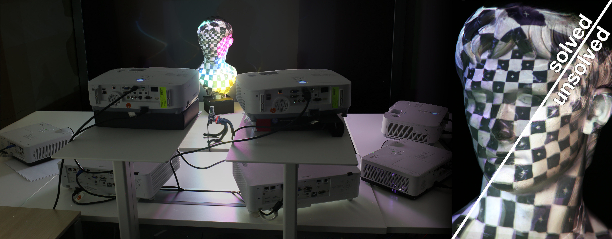
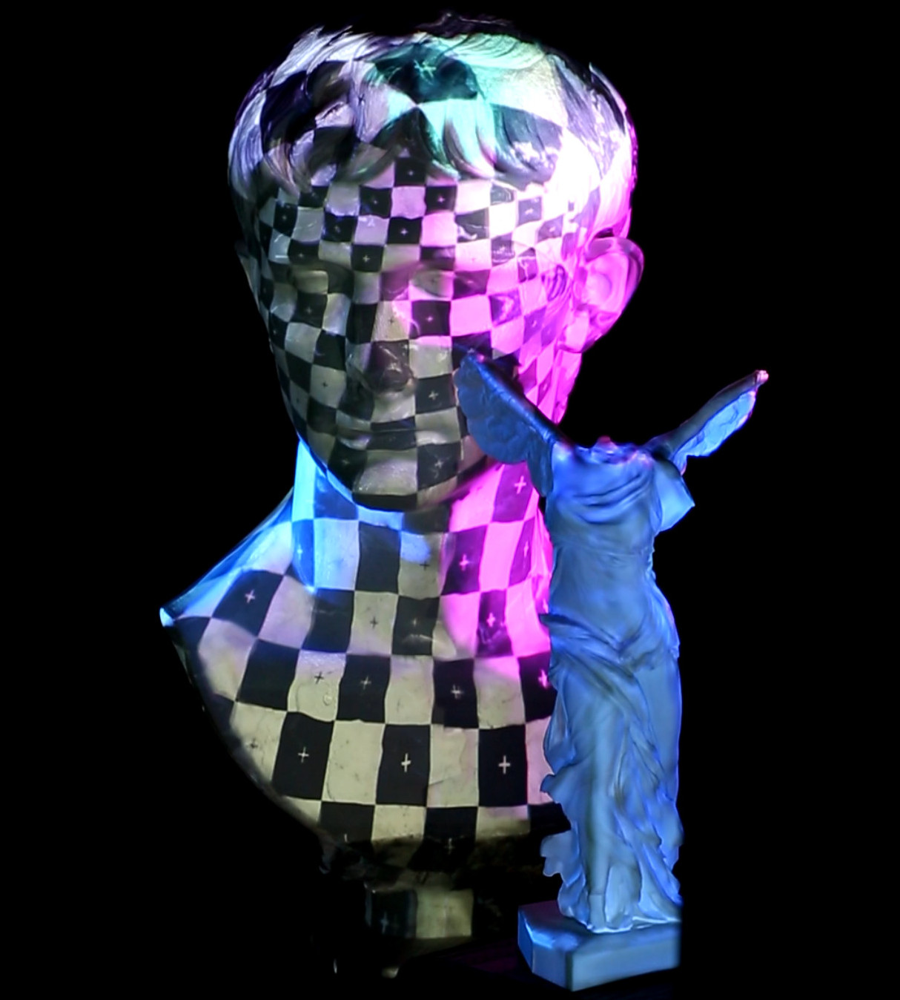
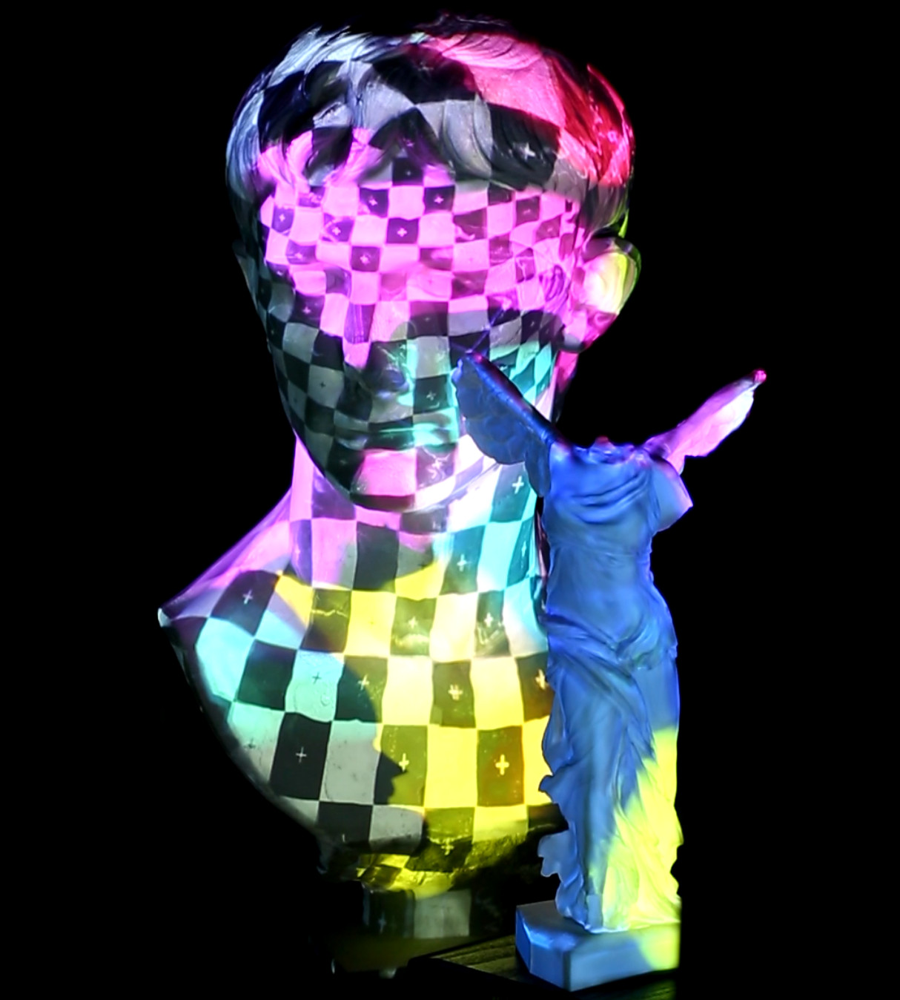

# Projection Mapping

This project implements an open-source projection mapping system, which supports a large number of projectors illuminating one or more target objects.
The objects are tracked in real-time using a depth camera.
The system corrects the brightness of all images sent to the projectors to ensure a consistent illumination on the object surface and mitigates common artifacts stemming from incorrect calibrations.
In order to support many projectors, you can employ multiple computers, which communicate over a simple network protocol.

The code includes all parts necessary to get a projection mapping system up and running, including a high-quality calibration routine, a depth-camera based object tracker, the actual brightness solver, and the networking.

The source code is based on this project: https://github.com/pkurth/D3D12Renderer

  
   

## Build Instructions

I have tried to keep the build process as simple as possible.
Therefore you will not need any build tools installed on your machine.
The project uses [Premake](https://github.com/premake/premake-core), but all you need comes with the source.

- Clone the repository and make sure to clone with submodules. 
- Double-click the _generate.bat_ file in the root directory to generate a Visual Studio 2019 solution.
- Open the solution and build. 
This _should_ work directly. 
Visual Studio sometimes reports an "Unspecified error" when building. 
In that case either restart Visual Studio or re-generate the project (_generate.bat_) and you are good to go.
- If you add new source files (or shaders), re-run the _generate.bat_ file.

The assets seen in the screenshots above are not included with the source code. 

## System Requirements

This project uses Direct3D 12 as the only rendering backend and thus the only supported platforms are Windows 10 or higher. 
The project is only tested with Visual Studio 2019, and only on NVIDIA GPUs, but _should_ work fine on AMD.

You will probably need a GPU which supports shader model 6.1 or higher.
You can try setting this to something lower (top of _premake5.lua_), but there might be shader compilation errors, because for shader models lower than 6, Visual Studio switches to another shader compiler (FXC).

The project files are currently generated with the AVX2 instruction set. 
If your processor does not support this, set another instruction set (again, top of _premake5.lua_).

All other dependencies (external libraries) either come directly with the source code or in the form of submodules.

